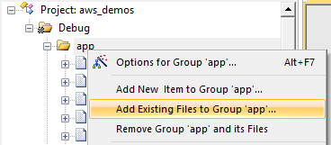
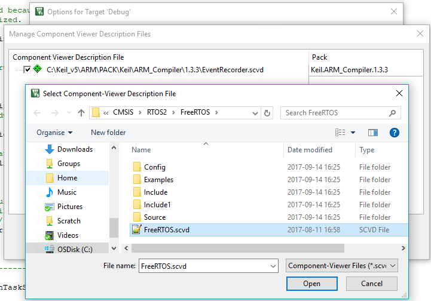
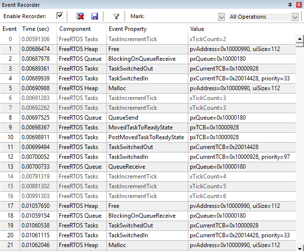
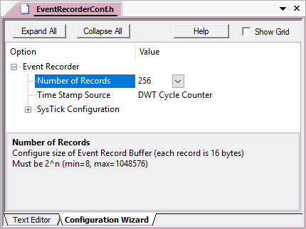
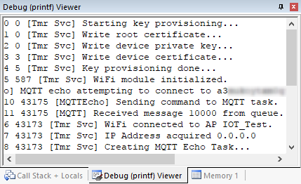

Add events to Amazon FreeRTOS
=============================

Prerequisites
-------------

1.  Download [**Amazon FreeRTOS Device Software**](https://github.com/MDK-Packs/amazon-freertos) and extract it to a folder which will be referred to as *&lt;BASE\_FOLDER&gt;*.
2.  Make sure that your MDK installation has the latest versions of the following packs installed:
    *   **Keil::STM32L4xx_DFP**
    *   **ARM::CMSIS**
    *   **ARM::CMSIS-FreeRTOS - 9.1.0**
    *   **Keil::ARM\_Compiler**
3.  Copy the file **freertos\_evr.h** from the *&lt;MDK\_root\_folder&gt;*\\ARM\\PACK\\ARM\\CMSIS-FreeRTOS\\9.1.0\\CMSIS\\RTOS2\\FreeRTOS\\Include\\ folder to the *&lt;BASE\_FOLDER&gt;*\\demos\\st\\stm32l475_discovery\\mdk\\ folder.
4.  Copy the file **freertos\_evr.c** file from the *&lt;MDK\_root\_folder&gt;*\\ARM\\PACK\\ARM\\CMSIS-FreeRTOS\\9.1.0\\CMSIS\\RTOS2\\FreeRTOS\\Source\\ folder to the *&lt;BASE\_FOLDER&gt;*\\demos\\st\\stm32l475_discovery\\mdk\\ folder.

In &micro;Vision
----------------

1.  Open the project *&lt;BASE_FOLDER&gt;*\\demos\\st\\stm32l475_discovery\\mdk\\aws\_demos.uvprojx.
2.   **Build** the project (**F7**) and confirm an error free build.
3.  Open the  **Manage Run-Time Environment** dialog. Enable these software components:
    *   **CMSIS::CORE**
    *   **Compiler::Event Recorder** 
    Click **OK**
4.  Add the **freertos\_evr.c** source file to the project (for example to the **app** group). Right-click on the app group and select
    **Add Existing Files to Group 'app'** **...** 
     
    Select **freertos\_evr.c** and click **Add**. Click **Close**.
5.  Open the  **Options for Target** dialog (**Alt+F7**). Go to the **C/C++** tab add set the include path to the project's root folder **.\\**. Click **OK**.
6.  Double-click on **FreeRTOSConfig.h** file in project tree under **app\_config** group and insert:  `#include "freertos_evr.h"`
7.  In the Project window, double-click the **main.c** file in the **app** group. Insert at before the main function:  `#include "EventRecorder.h"`
8.  In the main function, before calling `vTaskStartScheduler`, insert:  `EventRecorderInitialize(EventRecordAll, 1);`
9.  Connect your development board to your computer.
10. Open the  **Options for Target** dialog (**Alt+F7**). Go to the **Debug** tab and click on the **Manage Component Viewer Description Files** **...** button. In Manage Component Viewer Description Files add the **FreeRTOS.scvd** file that can be found in *&lt;MDK_root_folder&gt;*\\ARM\\PACK\\ARM\\CMSIS-FreeRTOS\\9.1.0\\CMSIS\\RTOS2\\FreeRTOS\\: 
     
    Click **Open**, and click **OK** twice.
12.  Rebuild the project (**F7**).
13.  Start a **Debug session (Ctrl+F5)**.
14.  Open the **Event Recorder Window**.
15.  **Start the code execution**.
16. In the **Event Recorder Window**, you should now see **FreeRTOS Events**:
     

Re-targeting UART printf debug to Event Recorder
------------------------------------------------

1.   Stop the **Debug session (Ctrl + F5)**.
2.  Remove the file **retarget\_io.c** from **app** group. Right-click the file and select **Remove File 'retarget_io.c'**. Confirm the removal.
3.  Open the **main.c** file and replace the function:

        void vMainUARTPrintString( char * pcString )
        {
             const uint32_t ulTimeout = 3000UL;
             HAL_UART_Transmit( &xConsoleUart,
                                ( uint8_t * ) pcString,
                                strlen( pcString ),
                                ulTimeout );
        }

    with:

        void vMainUARTPrintString( char * pcString )
        {
          uint32_t i;
          for (i = 0; i < strlen(pcString); i++) {
            putchar(pcString[i]);
          }
        }

4.  Edit **main.c** and remove the function:

        void * malloc( size_t xSize )
        {
            configASSERT( xSize == ~0 );
            return NULL;
        }

5.   Open the **Manage Run-Time Environment** window. For the software component **Compiler::I/O::STDOUT** select **EVR** and click **OK**.
6.  In the Project window, expand the **Compiler** group. Double-click the **EventRecorderConf.h (Event Recorder)** file. Click on **Configuration Wizard** and select **256** instead of 64 for the **Number of Records**: 
    
8.   Rebuild the project (**F7**).
9.   Start a **Debug session (Ctrl+F5)**.
10.   Open the **Debug (printf) Viewer**. You should see the output now: 
    
